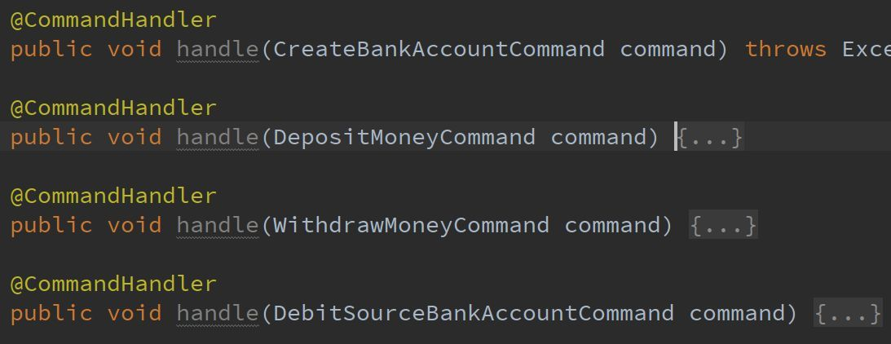

# Command Handler

Command Handler 负责处理 Command，每个 Command Handler 只负责处理一种类型的 Command。

## 定义

在 axon 中，在 spring 下定义 Command Handler 非常简单，只要定义一个普通的 spring bean：

```java
@Bean
public BankAccountCommandHandler bankAccountCommandHandler() {
    return new BankAccountCommandHandler(axonConfiguration.repository(BankAccount.class), eventBus);
}
```

然后在这个 spring bean 的方法上加一个 @CommandHandler 的注解：



这个方法就可以扮演 Command Handler 的角色，而这个方法的参数就是对应的 Command 类型。

## Command 处理流程

Command Handler 从 repository 中获取领域对象(Aggregates)并执行他们的方法来修改他们的状态。这些 Aggregates 通常包含实际的业务逻辑，同时也因此需要负责保护他们自己的不可变量。

Aggregates 的状态变更导致 Domain Events 的生成。Domain Events 和 Aggregates 组成 domain model / 领域模型。

以下是一个 CommandHandler 的工作代码，用来处理 DepositMoneyCommand 命令：

```java
@CommandHandler
public void handle(DepositMoneyCommand command) {
	// 从 repository 中装载 BankAccount 的Aggregate
    Aggregate<BankAccount> bankAccountAggregate = repository.load(command.getBankAccountId());
    // 通过 bankAccountAggregate 来执行 deposit 操作
    // deposit 操作的实现是通过 BankAccount 这个 Aggregate 来执行的
    bankAccountAggregate.execute(bankAccount -> bankAccount.deposit(command.getAmountOfMoney()));
}
```

而在 BankAccount 中，deposit() 方法的实现，是发送一个 MoneyDepositedEvent 到 event bus：

```java
@Aggregate
public class BankAccount {
	......
	public void deposit(long amount) {
        apply(new MoneyDepositedEvent(id, amount));
    }
}
```

Event bus 会随后将 MoneyDepositedEvent 分派给敢兴趣的 Event handler.

