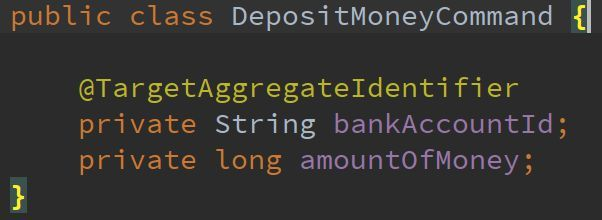
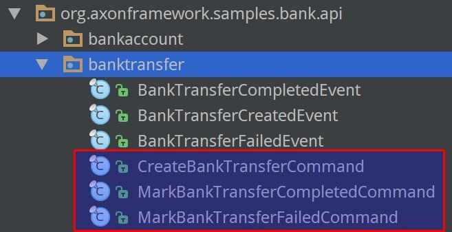

# Command

## 表示方式

在 Axon 中，Command的表示方式要要求：

1. Command 通常是以简单直白的对象来表示，包含 command handler 执行这个 command 时需要的所有数据。

    

	如图所示，在我们的例子(在账户上存钱)中，DepositMoneyCommand 包含了这个命令需要的数据：

    - bankAccountId： 存钱的账户
    - amountOfMoney： 存钱的数量

2. Command 的名字表示命令的意图。

	这是银行账户操作的对应命令，每个命令对应一个Command对象。

    

	这是更为复杂也最为经典的转账操作：

	

用Java的说法，这意味着类的名字足以指明需要做什么，而命令的字段提供操作所需的信息。

## Axon的支持

Axon 中对于 Command 没有任何要求，简单的 POJO 即可。

> TODO: @TargetAggregateIdentifier 后面再讲。

