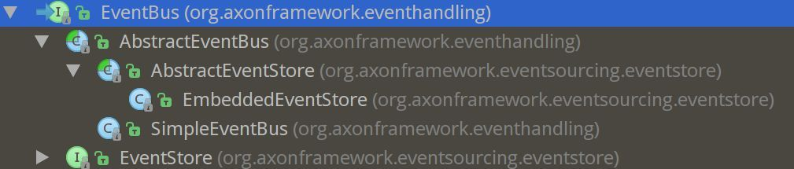

# Event Bus

Event Bus 将事件分派给所有感兴趣的 Event Listener 。可以是同步或者异步。异步事件分派容许命令执行返回并将控制交还给用户，而事件在后台被分派和处理。不需要等待事件处理完成可以让应用更具响应性。另一方面，同步事件处理更简单，也更容易理解。 同步处理也允许几个Event Listener 处理同一事务中的事件。

## Axon

Axon 中 EventBus 的实现和继承结构：

- EventBus： 接口定义
- AbstractEventBus
- SimpleEventBus

> TBD: 怎么初始化 Event Bus?