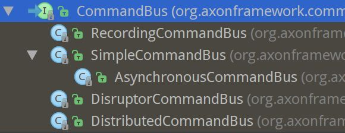

# Command Bus

Command Bus 接收 Command 并将它们路由给 Command Handler. 每个 Command Handler 负责一个特定的 Command 类型并根据 command 的内容执行操作逻辑。

在某些情况下，也可以执行操作逻辑而不管实际的命令类型，如验证、日志或认证。

## Axon的实现

Axon 中 CommandBus 的实现类和继承结构：



### CommandBus

接口定义


```java
package org.axonframework.commandhandling;
public interface CommandBus {

	// 将指定命令分派到订阅到这个命令类型的 command handler
	default <C> void dispatch(CommandMessage<C> command) {
        dispatch(command, LoggingCallback.INSTANCE);
    }
}

```


