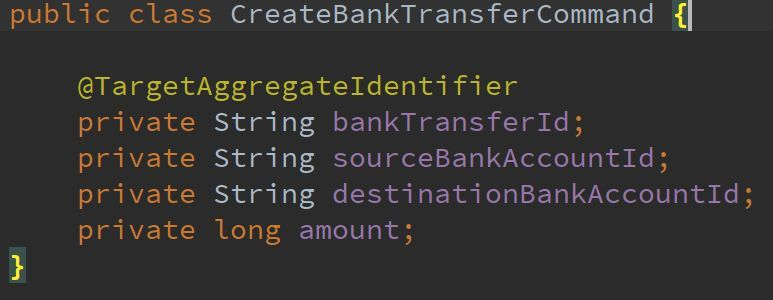
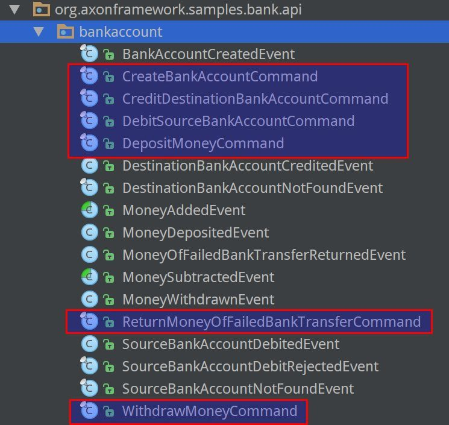

# Command

## 表示方式

1. Command 通常是以简单直白的对象来表示，包含 command handler 执行这个 command 时需要的所有数据。

    

2. Command 的名字表示命令的意图。

	

    

用Java的说法，这意味着类的名字足以指明需要做什么，而命令的字段提供操作所需的信息。

## Axon的支持

Axon 中对于 Command 没有任何要求，简单的 POJO 即可。

> TODO: @TargetAggregateIdentifier

