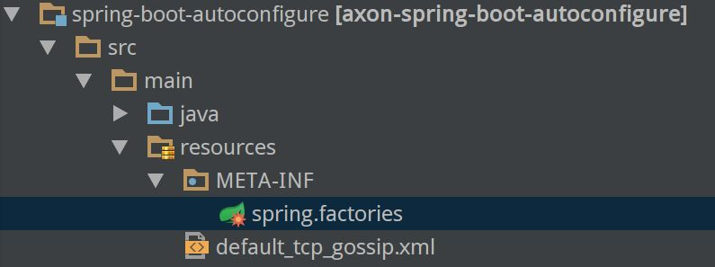

# AutoConfigure

## AxonAutoConfiguration

在 axon 的 spring-boot-autoconfigure 子项目下，找到 spring.factories 文件：



其内容如下：

```bash
org.springframework.boot.autoconfigure.EnableAutoConfiguration=org.axonframework.boot.AxonAutoConfiguration
```

## 自动配置的内容

### Serializer

自动配置的 Serializer 是 `XStreamSerializer`：

```java
@Bean
@ConditionalOnMissingBean
public Serializer serializer() {
    XStreamSerializer xStreamSerializer = new XStreamSerializer();
    xStreamSerializer.getXStream().setClassLoader(beanClassLoader);
    return xStreamSerializer;
}
```

### EventStore

自动配置的 EventStore 是 `EmbeddedEventStore`：

```java
@Qualifier("eventStore")
@Bean(name = "eventBus")
@ConditionalOnMissingBean({EventBus.class, EventStore.class})
@ConditionalOnBean(EventStorageEngine.class)
public EventStore eventStore(EventStorageEngine storageEngine, AxonConfiguration configuration) {
    return new EmbeddedEventStore(storageEngine, configuration.messageMonitor(EventStore.class, "eventStore"));
}
```

### EventBus

自动配置的 EventBus 是 `SimpleEventBus`：

```java
@Bean
@ConditionalOnMissingBean({EventStorageEngine.class, EventBus.class, EventStore.class})
public EventBus eventBus(AxonConfiguration configuration) {
    return new SimpleEventBus(Integer.MAX_VALUE, configuration.messageMonitor(EventStore.class, "eventStore"));
}
```

### CommandBus

自动配置的 CommandBus 是 `SimpleCommandBus`：

```java
@ConditionalOnMissingBean(ignored = {DistributedCommandBus.class})
@Qualifier("localSegment")
@Bean
public CommandBus commandBus(TransactionManager txManager, AxonConfiguration axonConfiguration) {
    SimpleCommandBus commandBus = new SimpleCommandBus(txManager, axonConfiguration.messageMonitor(CommandBus.class, "commandBus"));
    commandBus.registerHandlerInterceptor(new CorrelationDataInterceptor<>(axonConfiguration.correlationDataProviders()));
    return commandBus;
}
```

### TransactionManager

自动配置 TransactionManager 时，先看有没有 `PlatformTransactionManager`，如果有则配置为 `SpringTransactionManager`，如果没有，则取默认配置，结果为 `NoTransactionManager`:

```java
@AutoConfigureAfter(TransactionConfiguration.class)
@Configuration
public static class DefaultTransactionConfiguration {

    @Bean
    @ConditionalOnMissingBean(TransactionManager.class)
    public TransactionManager axonTransactionManager() {
        return NoTransactionManager.INSTANCE;
    }

}

@Configuration
@ConditionalOnClass(PlatformTransactionManager.class)
@AutoConfigureAfter(name = "org.springframework.boot.autoconfigure.orm.jpa.HibernateJpaAutoConfiguration")
public static class TransactionConfiguration {

    @Bean
    @ConditionalOnMissingBean
    @ConditionalOnBean(PlatformTransactionManager.class)
    public TransactionManager axonTransactionManager(PlatformTransactionManager transactionManager) {
        return new SpringTransactionManager(transactionManager);
    }
}
```


